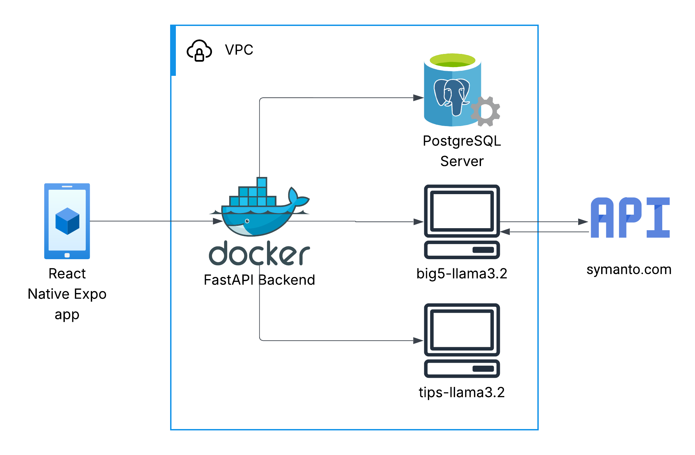
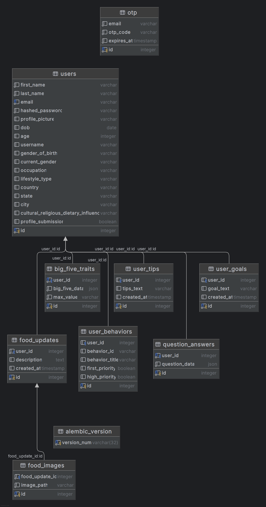

# Mindful Eating Backend


## Overview
The **Mindful Eating Backend** is a FastAPI‑powered service that blends behavioral data science with LLM.  
It integrates personality‑driven recommendations via two fine‑tuned **LLama3.2** language models, using **Big Five personality traits** and **mindful‑eating behavior classifications** to deliver daily, personalized tips.

## Features

- **User Goal Management** – create, update, and retrieve daily eating goals.
- **Personalized Tips** – AI‑generated tips informed by dominant Big5 traits.
- **Questionnaire Handling** – capture user answers to refine recommendations.
- **JWT Authentication** – secure access tokens for every request.
- **SQLAlchemy + PostgreSQL** – robust relational data layer.

## Technologies Used

| Category          | Stack                        |
|-------------------|------------------------------|
| Web Framework     | FastAPI                      |
| ORM & Migrations  | SQLAlchemy · Alembic         |
| Data Validation   | Pydantic v2                  |
| AI & LLM Serving  | Ollama · Unsloth · LLaMA 3.2 |
| Containerisation  | Docker · Docker Compose      |
| Production Server | Gunicorn + UvicornWorkers    |

## AI Models Used
This project ships with two fine‑tuned LLMs:
- **big5‑llama3.2** – predicts a user’s Big Five trait values from free‑text input.
- **mindful-tips** – returns daily mindful‑eating tips tailored to the dominant trait and the user‑selected eating behavior.

## File Structure
The codebase is organized into logical components:
```
mindful-eating-backend/
├── app/
│   ├── controllers/     # Business logic
│   ├── models/          # Database models
│   ├── routes/          # API endpoints
│   ├── schemas/         # Data validation
│   ├── services/        # Services layer
│   └── utils/           # Utility functions
├── migrations/          # Alembic migrations
├── main.py              # Application entry point
├── docker-compose.yml   # Docker configuration
└── requirements.txt     # Dependencies
```

## System Design
For a complete overview of the data flow, consult the diagrams below:



## Setup and Installation
1. Clone the repository:
   ```bash
   git clone https://github.com/samshad/mindful-eating-backend.git
   cd mindful-eating-backend
   ```
2. Set up a virtual environment:
   ```bash
   python3 -m venv venv
   source venv/bin/activate
   ```
3. Install dependencies:
   ```bash
   pip install -r requirements.txt
   ```

4. Start the development server:
   ```bash
   uvicorn app.main:app --reload
   ```

### Configure environment variables
Create a`.env` file in the project root (refer to `.example.env`):
```env
DATABASE_URL=[URI to your PostgreSQL database]
SECRET_KEY=your_jwt_secret
OLLAMA_BASE_URL=[URL to your Ollama server]
BIG_FIVE_MODEL=samshad/big5-llama3.2
TIPS_GENERATOR_MODEL=samshad/mindful-tips
```

### Database migrations
Run the following command to apply database migrations:
```bash
  alembic upgrade head
```


## Running with Docker

This application can be easily set up and run using Docker, which ensures consistent environments across different development and deployment setups.

### Prerequisites

- [Docker](https://www.docker.com/get-started) installed on your system
- [Docker Compose](https://docs.docker.com/compose/install/) (usually included with Docker Desktop installations)

### Running the Application with Docker

#### Option 1: Using Docker Compose (Recommended)

This method sets up the entire application stack with a single command:

1. Clone this repository to your local machine
2. Navigate to the project directory
3. Create a `.env` file based on the provided `.example.env` template
4. Run the application:
   ```bash
   docker-compose up -d
   ```
5. To stop the application, run:
   ```bash
   docker-compose down
   ```

## API Endpoints
Outlined below are a few key endpoints:
- **Authentication routes**: `/auth/*` endpoints for user authentication
- **Question routes**: `/question/*` endpoints for question-related operations
- **Behavior routes**: `/behavior/*` endpoints for behavior-related features
- **Goal routes**: `/goal/*` endpoints for goal management
- **Tips routes**: `/tips/*` endpoints for retrieving tips
- **Food update routes**: `/food-update/*` endpoints for food tracking updates
- **Big Five routes**: `/big-five/*` endpoints related to a "Big Five" feature (dominant personality assessment)

## Contribution Guidelines
Contributions are welcome! Please follow these steps:
1. Fork the repository and create a new branch.
2. Make your changes and test thoroughly.
3. Submit a pull request with a clear description of the changes.

## Roadmap
- ✅ Prototype accuracy ≈ 88 % on tips model  
- 🔄 Dataset validation with registered dietitian and psychologist  
- 🚀 Deploy on AWS ECS + RDS

## License
This project is licensed under the MIT License. See the [LICENSE](LICENSE) file for details.

